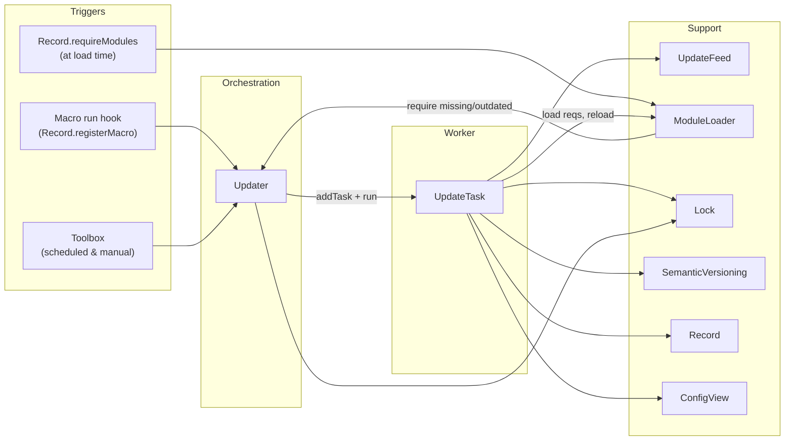
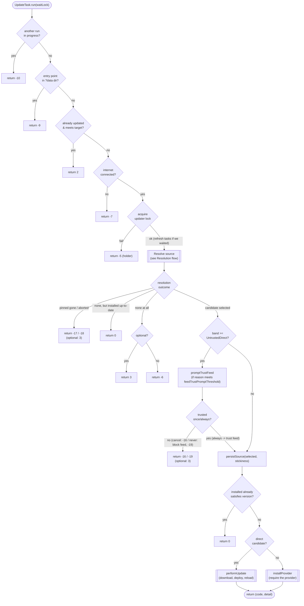
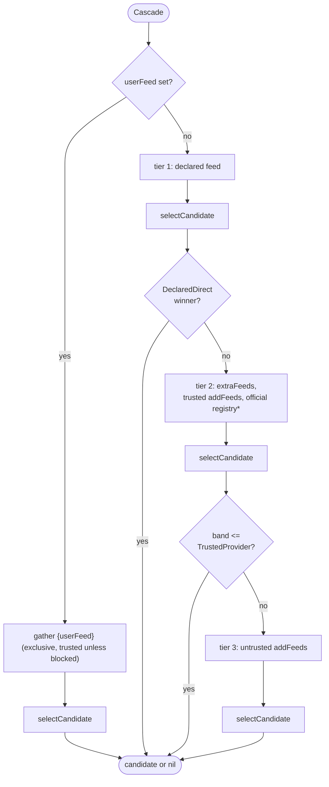
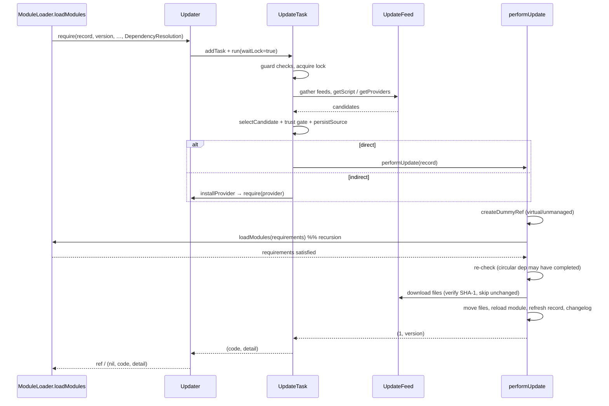

# DependencyControl Updater — Design & Architecture

This document describes how DependencyControl installs and updates scripts and modules: the components involved, how an update is triggered, and the full decision flow of a single update task. It targets contributors working on the updater, not end users (see the README for user-facing behavior).

## Scope

The "updater" is the subsystem that, given a version record, finds a trustworthy source that satisfies a required version, downloads it, deploys its files, and reloads the affected module. It also resolves a script's required modules (installing missing or outdated ones) and runs periodic background update checks.

## Component map

| Module | Role |
|---|---|
| `Updater` | Per-host orchestrator. Owns the queue of update tasks, the cross-process lock, and the official trust lists. Exposes the `require` (dependency) and `scheduleUpdate` (background) entry points. |
| `UpdateTask` | The worker for one record. Owns the whole resolve → trust-gate → download → deploy → reload flow for a single package. |
| `UpdateFeed` | Loads/caches a feed (download + schema check) and answers queries: `getScript` (a package by namespace/channel), `getProviders` (modules that `provides` a name), `getKnownFeeds`. |
| `ModuleLoader` | Loads modules from disk (private then global copies), orchestrates `loadModules` for a record's requirements, and manages dummy refs for circular dependencies. |
| `Lock` | Cross-process advisory lock (backed by an OS file lock) that serializes updates and survives a crashed holder. |
| `SemanticVersioning` | Version encode/decode/compare and npm-style range matching (`parseRange`, `satisfiesRange`, `rangesIntersect`, `getRangeMaxVersion`). |
| `Record` (`DependencyControl`) | The version record: identity, version, config, requirements, `provides` aliases, and the persisted `currentSource`. |
| `ConfigView` | Per-package and global config persistence. |



## Entry points

Every update originates from one of three places, each carrying a different `UpdateReason` that later gates whether the user may be prompted (see [Reasons and prompt thresholds](#reasons-the-context-ladder-and-prompt-thresholds)).

- **Dependency resolution** — when a record is constructed, `Record.requireModules` calls `ModuleLoader.loadModules`, which loads each requirement (private copy, then global). A requirement that is missing or fails its version constraint is forwarded to `Updater.require`, defaulting to reason `DependencyResolution`. This path is **blocking**: it waits on the updater lock because the caller needs the module now.
- **Macro run hook** — `Record.registerMacro` wraps the macro callback so that running the macro first calls `Updater.scheduleUpdate` for the script, then releases the lock, then runs the macro. This is a **non-blocking** background check (reason `AutoUpdate`).
- **Toolbox** — the DependencyControl Toolbox runs centralized scheduled checks for every installed record at startup (reason `AutoUpdate`) and performs explicit user-initiated installs/updates (reason `UserRequested`).

## Core concepts

### Records, feeds, candidates

A **record** describes one package (a macro or a module). A **feed** is a JSON registry that lists packages and, per release, the files and `provides` aliases. During resolution, every package a feed can supply for the requirement becomes a **candidate** (`CandidatePackageSource`: `{updateRecord, feedUrl, isDirect, trustBand, providesVersion?}`). A candidate is **direct** (`isDirect`) when the feed offers the package by its own name, or **indirect** when it comes from a **provider** — a different module that declares it `provides` the required name (e.g. `dkjson` provides `json`).

### Trust bands

Candidates are ranked by **trust band first, version second**, so a feed can't win merely by advertising a higher version. Lower band = preferred.

| Band | Name | Meaning |
|---|---|---|
| 1 | `DeclaredDirect` | The package's own/declared feed (trusted), by name. Also the band a *remembered provider* is boosted to. |
| 2 | `TrustedDirect` | Another trusted feed, by name. |
| 3 | `TrustedProvider` | A trusted feed, via a provider. |
| 4 | `UntrustedDirect` | An untrusted feed, by name. |
| 5 | `UntrustedProvider` | An untrusted feed, via a provider. |

Trust sets come from `getTrustedFeeds`/`getBlockedFeeds`: trusted = DepCtrl's official feeds (`getOfficialTrustedFeeds`, cached) ∪ user `extraFeeds` ∪ `trustedFeeds`; blocked = official block list (`getOfficialBlockedFeeds`) ∪ user `blockedFeeds`. `extraFeeds` and `trustedFeeds` both grant trust, but only `extraFeeds` are discovery roots and tier-2 search candidates: `trustedFeeds` are trust-only — they raise a feed's trust when it's reached another way, but are never themselves searched (tier 2) or crawled. `isUserTrusted` reports membership in either user list, distinct from `getOfficialTrustedFeeds`. Each block entry is a `{url, matchMode, reason?}` object matched case-insensitively as a URL prefix or an exact URL; `getBlockedFeeds` normalizes them to `BlockedFeedEntry`. A blocked feed is dropped before banding and overrides everything, including `userFeed`.

### Reasons, the context ladder, and prompt thresholds

The `UpdateReason` values double as the rungs of the update-context ladder, ordered by autonomy: `user-requested` < `dependency-resolution` < `auto-update`. Settings that gate behavior by context hold an `UpdateContextCeiling` — one of those rungs, or `off` (below all of them) — meaning "up to and including this context". The shared predicate is `UpdateTask.isWithinContextCeiling(reason, ceiling)`, a rank comparison on the ladder.

Two behaviors are gated this way: whether an update context may **run at all** (`updates.mode`, default `auto-update` = everything; checked by `Updater.__isEnabledFor` in `addTask`/`scheduleUpdate`) and whether a task may **prompt** (`shouldPrompt(threshold)` tests the task's reason against the relevant threshold).

The two prompt kinds have **separate** thresholds: `feedTrustPromptThreshold` (default `auto-update` — decides update success, so it may prompt in every context) and `packageChoicePromptThreshold` (default `user-requested` — a minor preference, so only for user-initiated actions). `off` disables a prompt kind entirely.

The trust prompt (`promptTrustFeed`) returns a `FeedTrustDecision`: `once` proceeds for this install only, `always` records the feed via `addTrustedFeed`, `never` records it via `addBlockedFeed` (then fails `-19`); a cancelled prompt is `nil` (fails `-16`). The source chooser (`promptSelectPackageSource`) likewise returns the picked candidate plus the `SourceChoiceStickiness` to persist.

### Source stickiness

After a source satisfies a package, the choice is remembered per-package in `currentSource` (`{feedSource, feedUrl?, channel, provider?, stickiness}`) so the chooser isn't re-shown needlessly. `feedSource` (`SourceFeedKind`: `self-declared`/`user-feed`/`provider`/`other`) records *where* the source came from; the URL is derived at resolution for every kind but `other`, so a remembered choice follows feed migration. `stickiness` (`SourceChoiceStickiness`) records *how sticky* the choice is — see the [state diagram](#source-stickiness-state).

### Status codes

The run/require result is a `(code, detail)` pair. **Sign is the convention:** `>= 0` means success or a benign skip; `< 0` is an error whose message comes from `getUpdaterErrorMsg`.

| Code | Meaning |
|---|---|
| `1` | Installed/updated successfully (detail: version). |
| `0` | Already up-to-date; nothing to do. |
| `2` | Already updated earlier this session (or by another updater). |
| `3` | Optional dependency skipped (any reason). |
| `-5` | Another update is already running (detail: holder). |
| `-6` | No suitable package found in any reachable feed. |
| `-7` | No internet connection. |
| `-9` | Entry point lives in Aegisub's `?data` dir — managed elsewhere. |
| `-10` | This task is already running. |
| `-15` | Requirements couldn't be satisfied. |
| `-16` | Only an untrusted feed could satisfy, and trust wasn't granted. |
| `-17` | A pinned source is no longer available. |
| `-18` | Aborted by the user at the source chooser. |
| `-19` | The only feed that could satisfy was blocked by the user at the trust prompt. |
| `-30 / -33 / -35 / -50` | File-stage errors (temp dir, path escape, bad SHA-1, move failed). |
| `-55…-58` | Installed, but the module couldn't be located/loaded/recorded afterward. |
| `-140 / -245` | Download-manager component errors (codes `<= -100`). |

(`new()` may also return `-1` updater disabled / `-2` invalid namespace; `scheduleUpdate` has its own pre-check returns: `-1` disabled, `-3` virtual/unmanaged, `0` interval not elapsed, `-9` protected path.)

## The update process

`UpdateTask.run(waitLock)` is the heart of the system. The top-level flow runs guard checks, resolves a source, gates trust, persists the choice, and dispatches the install.



### Resolution flow

Resolution turns the feed landscape into a single chosen candidate. It first honors a sticky choice (pinned/retain), otherwise runs a lazy, trust-ordered cascade, then optionally lets the user pick.

```mermaid
flowchart TD
    R(["Resolve"]) --> Read["read currentSource:<br/>remembered, stickiness, stickyProvider"]
    Read --> Sticky{stickiness ==<br/>pinned or retain?}

    Sticky -- yes --> LoadRem["gather remembered feed early<br/>(constrained to userFeed if set)<br/>matchRememberedCandidate"]
    LoadRem --> Reuse{remembered candidate<br/>still eligible?}
    Reuse -- yes --> UseReuse["selected = remembered<br/>(skip chooser)"]
    Reuse -- "no, pinned" --> PinMiss["pinned gone<br/>-> -17 (optional: 3)"]
    Reuse -- "no, retain" --> Cascade

    Sticky -- no --> Cascade["Lazy feed cascade<br/>(see Cascade)"]
    Cascade --> Have{candidate<br/>selected?}
    Have -- no --> NoneOut["none -> run() handles<br/>up-to-date / no-package"]
    Have -- yes --> SkipPrompt{reuse, or<br/>stickiness == auto?}
    SkipPrompt -- yes --> Out(["selected"])
    SkipPrompt -- no --> ChoiceLogic

    ChoiceLogic{stickiness} -->|retain miss| RetMiss{interactive?<br/>(packageChoicePromptThreshold)}
    RetMiss -- yes --> RePrompt["promptSelectPackageSource<br/>(flagged: choice unavailable)"]
    RetMiss -- no --> Downgrade["stickiness = once<br/>keep algorithm pick"]
    ChoiceLogic -->|once / unset| RealChoice{>1 source &<br/>interactive?}
    RealChoice -- yes --> Prompt["promptSelectPackageSource<br/>(preselect remembered/winner)"]
    RealChoice -- no --> Out
    RePrompt --> AbortQ
    Prompt --> AbortQ{aborted?}
    AbortQ -- yes --> AbortOut["-> -18 (optional: 3)"]
    AbortQ -- no --> Out
    Downgrade --> Out
    UseReuse --> Out
```

`packageChoiceOfferAllSources` (global, default false) widens the chooser: when false it only fires on an exact band+version tie (`tied`); when true it offers every eligible source (`eligible`, sorted best-first), including lower-ranked and untrusted ones (flagged). Picking an untrusted source still passes through `promptTrustFeed` in `run`.

### Cascade and ranking

Feeds are fetched lazily, closest-first, and `selectCandidate` is re-run after each tier so a satisfying, sufficiently-trusted source short-circuits the rest.



\* The official registry crawl is skipped for **optional** dependencies (a nice-to-have shouldn't trigger a registry-wide fetch).

For each gathered candidate, `getCandidateRankVersion` decides eligibility and the ranking version:

- **Direct** — eligible if its release version meets the target; ranked by that version.
- **Provider** — eligible if its declared alias range (or `*` when it declares none) can still supply a version meeting the target (`rangesIntersect(range, ">=target")`); ranked by the highest version that range covers (`getRangeMaxVersion`). The provider's *own* release version doesn't affect its rank as a provider.
- Either way, the candidate must support the current platform and list files to install.

`selectCandidate` then sorts eligible candidates by band → ranking version (desc) → declared-feed tie-break → namespace, returning the winner, the tied top set, and the full eligible list. A **remembered provider** (`currentSource.provider.namespace`) found on a trusted feed is boosted to `DeclaredDirect` during gathering, so a version bump updates it in place instead of switching providers.

## Dependency resolution and recursion

Installing a package can require installing *its* dependencies, so `performUpdate` re-enters the loader, which can re-enter the updater. Dummy refs registered before requirements are loaded let circular dependencies resolve without infinite recursion.



## Concurrency and locking

A single global, cross-process lock (`UPDATER_LOCK_NAMESPACE/run`, `Lock.Scope.Global`) serializes all updates so two scripts or processes don't deploy at once. `run` acquires it after the cheap guard checks; `performUpdate` and the download loop `renewLock` to keep the lease alive during long downloads; the macro hook and `requireModules` release it when done. The lease is backed by an OS advisory file lock that the system frees if the holder crashes, so a crash can't permanently wedge updates. If a task had to **wait** for the lock, another updater may have finished the same work in the meantime, so on acquisition each queued module task runs `refreshRecord` to pick up that result instead of re-installing. `Updater.isRunning()` reports the current holder without taking the lock.

## Source stickiness state

`currentSource.stickiness` starts `unset` and is set by the source chooser; thereafter it governs whether the chooser reappears.

```mermaid
stateDiagram-v2
    [*] --> unset

    unset --> once: chooser → "Just This Once"
    unset --> retain: chooser → "Remember"
    unset --> pinned: chooser → "Pin/Lock"
    unset --> auto: chooser → "Auto-Pick"

    once --> once: prompt again (choice remains)
    once --> retain: re-chosen
    once --> pinned: re-chosen
    once --> auto: re-chosen

    retain --> retain: remembered pick still eligible (reuse, no prompt)
    retain --> once: pick gone, non-interactive (downgrade)
    retain --> retain: pick gone, interactive → re-chosen

    pinned --> pinned: reuse when eligible; abort/skip when gone (never re-prompts)
    auto --> auto: never prompts; always takes the ranked pick
```

- **`unset`** — no preference; resolve normally and prompt only if interactive.
- **`once`** — always prompt when a choice remains, preselecting the remembered pick.
- **`retain`** — reuse the remembered pick whenever it's still eligible; if gone, re-prompt interactively or downgrade to `once` non-interactively.
- **`pinned`** — always reuse the pick; if it's gone, abort a required dependency (`-17`) or skip an optional one, and never re-prompt.
- **`auto`** — never prompt; always take the ranked pick, refreshing the remembered pick for information.

## Notes for maintainers

- The whole resolution path runs only after DependencyControl itself is loaded; a raw `require "json"` before DepCtrl loads won't resolve through this mechanism (accepted boundary).
- `getOfficialTrustedFeeds`/`getOfficialBlockedFeeds` (backed by the cached `loadOfficialFeedTrust` loader) are best-effort: if DepCtrl's own feed can't be loaded, only the DepCtrl feed URL is trusted, so third-party feeds are distrusted until it's reachable. A persistent cross-session trust cache would harden this.
